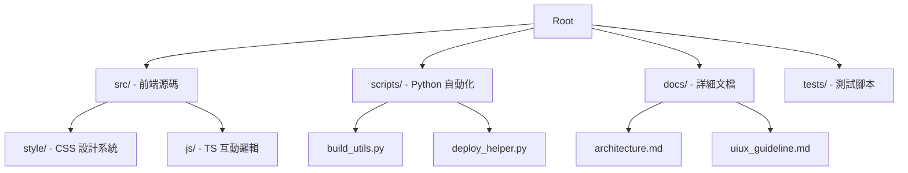

# 專案藍圖 (Project Map)

## 🏗️ 系統架構圖 (Mermaid)

## 📁 目錄結構詳細說明

- `Agents.md`: 指導 AI 編碼助手的專用 README。
- `README.md`: 專案首頁說明。
- `changelog.md`: 版本更迭記錄。
- `project_map.md`: (本文件) 專案地圖。
- `docs/`:
    - `architecture.md`: 技術架構決策與實踐細節。
    - `uiux_guideline.md`: 視覺與互動設計規範。
- `src/`:
    - `index.html`: 主頁面結構。
    - `style/`: 包含 `design-tokens.css` 與排版規範。
    - `ts/`: TypeScript 互動程式碼。
- `scripts/`: 存放所有重複性任務的 Python 腳本。
- `tests/`: 針對 `scripts/` 的單元測試。
- `pyproject.toml`: `uv` 環境配置。
- `package.json`: Vite 與 JS 依賴。
- `biome.json`: 極速代碼檢查配置。
